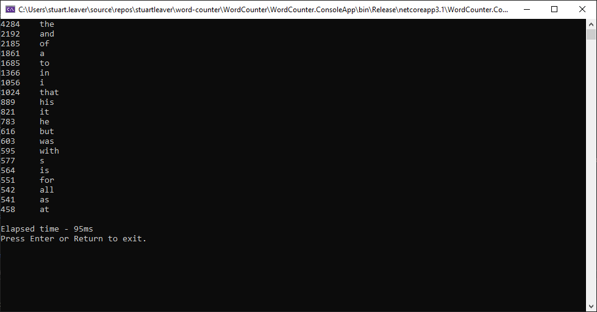
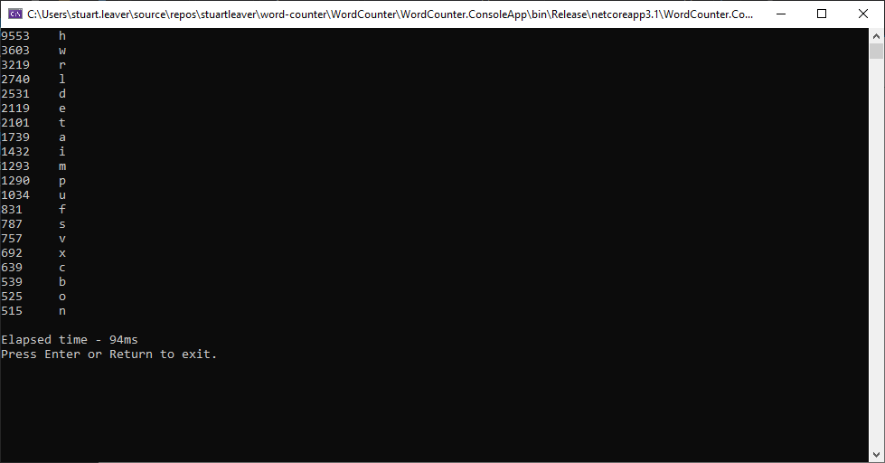

# Word Counter
Word Counter is  an application that will count the occurrences of words in a given file.

## The Problem
Given a text file as an argument, the program should read the file, and output the 20 most frequently used words in the file in order, along with their frequency. The output should be the same to that of the following bash program:
```
#!/usr/bin/env bash

cat $1 | tr -cs 'a-zA-Z' '[\n*]' | grep -v "^$" | tr '[:upper:]' '[:lower:]'| sort | uniq -c | sort -nr | head -20
```

## Sample Result
The output from the above command using the mobydick.txt file is:


## Running the application
The application can either be run from within Visual Studio or from a command line prompt.

If running from within Visual Studio, The application arguments will need to be set to include the file name and it's location.


If running from a command prompt, the command will need to include the file name and it's location.
```
WordCounter.ConsoleApp.exe C:\Users\stuart.leaver\source\repos\stuartleaver\word-counter\WordCounter\WordCounter.ConsoleApp\bin\Debug\netcoreapp3.1\mobydick.txt
```

## First Version
The first version of the application simply loads the file, formats the text in a similar way to the bas program above before splitting the words into a string array. The words are then counted before being output to the command prompt window.

This simple approach serves as a way of ensuring the output is correct as per the sample result. It also gives a baseline for performance. When running this version in release mode within Visual Studio, the time takes was 106ms.


## Second Version
This version changed the way the code checked to see if the word already existed in the dictionary from using `ContainsKey` to `TryGetValue`. As per the [Microsoft documentation](http://msdn.microsoft.com/en-us/library/bb347013.aspx), `TryGetValue` is more efficient, but it does depend on how many times the key is not already in the dictionary.

The result, running in Release mode from within Visual Studio was 98ms. This is not really much of an improvement over the first version and this is probably due to the sample file not being large enough for the efficiency of the `TryGetValue` method show.


## Third Version
While keeping the change to `TryGetValue`, this version also included the introduction of `Parallel.ForEach`. The idea behind this change is to count the words in each line in parallel, and thus, hopefully increasing the performance of the application.

As thought, this change would actually cause the word counting to produce the wrong result as the Dictionary being used is not thread safe. Therefor the `TryGetValue` code was put within a `lock`.

When run, the application did produce the same result as per the sample result above, however, there was only a very small, if that, performance improvement. Running as per the previous versions, it took 95ms.



Some thoughts behind this:
* Locking the dictionary would of had an impact on the performance.
* The lines in the sample file are not that long and so there may not be scope for a performance gain based on that.
* The `MaxDegreeOfParallelism` was changed to various values as a test, but this either had no impact at all or a negative impact. The more processes running, the more the lock would of played a part.

To switch between the version with `Parallel.ForEach` and the one without, change line 31 of `Program.cs` to either call `CountWordsByLine` or `CountWords`.

## Running Against Binary Files
The application runs even if it is passed an executable file. For example, the following is a result of testing with `C:\Windows\regedit.exe`:



## Notes
Some notes on the way somethings have been done and thoughts on further work:
* A Console Application was chosen was it produces a similar output to the bash program above with ease.
* In terms of Unit Test coverage, `Program.cs` has no coverage. Given that the majority of the code is calling the targeted framework code, an assumption has been made that this will have already been tested. The code for counting the words has a 98% coverage.
* When looking into the performance of parallelism:
  * Further word could be done to test counting words on a block of text rather than per line.
  * Testing on using a dictionary per process and then merging them once all process have finished. This could help reduce the impact of locking the dictionary.
  * Look at the use of `ConcurrentDictionary` for example. This was not done here as the idea was to try and stay away from the use of higher level language containers.
