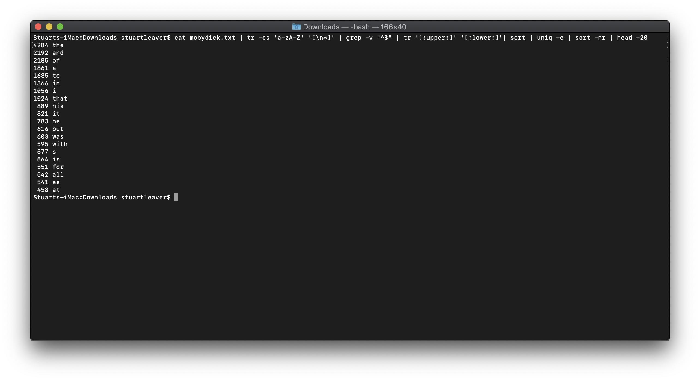
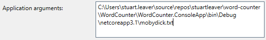
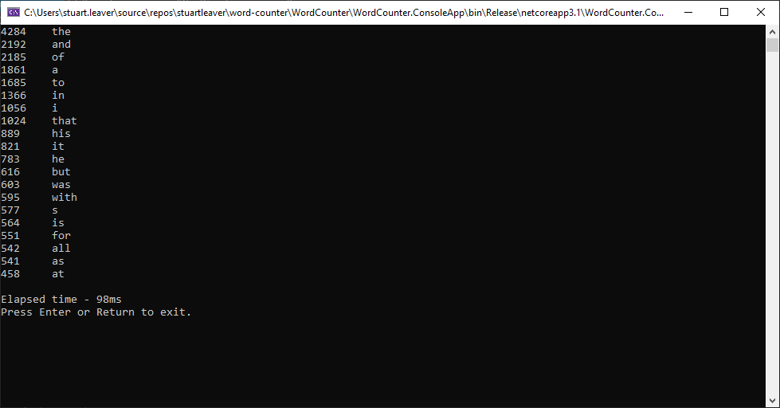

# Word Counter
Word Counter is  an application that will count the occurrences of words in a given file.

## The Problem
Given a text file as an argument, the program should read the file, and output the 20 most frequently used words in the file in order, along with their frequency. The output should be the same to that of the following bash program:
```
#!/usr/bin/env bash

cat $1 | tr -cs 'a-zA-Z' '[\n*]' | grep -v "^$" | tr '[:upper:]' '[:lower:]'| sort | uniq -c | sort -nr | head -20
```

## Sample Result
The output from the above command using the mobydick.txt file is:


## Running the application
The application can either be run from within Visual Studio or from a command line prompt.

If running from within Visual Studio, The application arguments will need to be set to include the file name and it's location.



If running from a command prompt, the command will need to include the file name and it's location.
```
WordCounter.ConsoleApp.exe C:\Users\stuart.leaver\source\repos\stuartleaver\word-counter\WordCounter\WordCounter.ConsoleApp\bin\Debug\netcoreapp3.1\mobydick.txt
```

## First Version
The first version of the application simply loads the file, formats the text in a similar way to the bas program above before splitting the words into a string array. The words are then counted before being output to the command prompt window.

This simple approach serves as a way of ensuring the output is correct as per the sample result. It also gives a baseline for performance. When running this version in release mode within Visual Studio, the time takes was 106ms.


## Second Version
This version changed the way the code checked to see if the word already existed in the dictionary from using `ContainsKey` to `TryGetValue`. As per the [Microsoft documentation](http://msdn.microsoft.com/en-us/library/bb347013.aspx), `TryGetValue` is more efficient, but it does depend on how many times the key is not already in the dictionary.

The result, running in Release mode from within Visual Studio was 98ms. This is not really much of an improvement over the first version and this is probably due to the sample file not being large enough for the efficiency of the `TryGetValue` method show.


